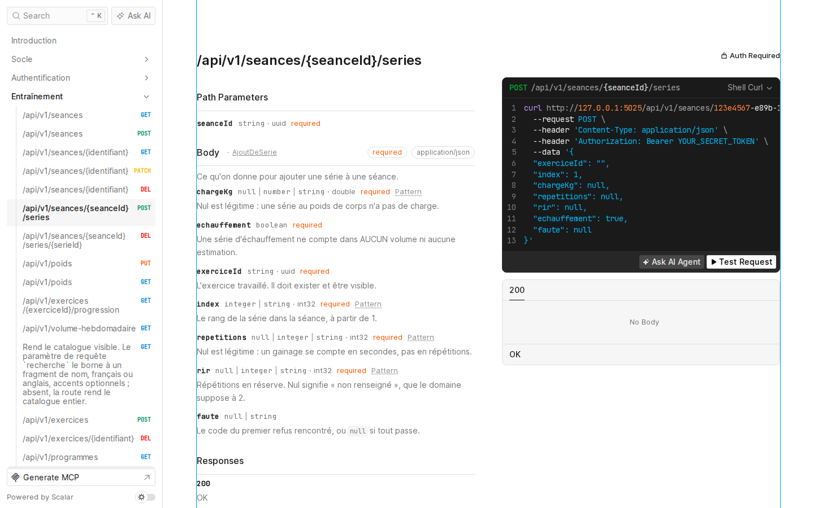

# Palier

[](https://github.com/warrox1993/palier/actions/workflows/ci.yml)

API backend en .NET 10 pour une application de suivi d'entraînement en musculation. Sa règle métier tient en une phrase : l'application informe, elle ne prescrit jamais. Elle rend des chiffres, des références et des écarts, jamais de consigne.

Ce dépôt est une vitrine technique. Il montre une API ASP.NET Core complète, sécurisée et testée sur une vraie base PostgreSQL, que l'on peut lancer en une commande et essayer dans le navigateur.



## Ce qui est livré, et ce qui ne l'est pas

Livré et testé :

- l'authentification complète : inscription, vérification de l'adresse par courriel, connexion, rafraîchissement, déconnexion, réinitialisation du mot de passe, double authentification TOTP, suppression du compte, connexion Google (facultative) ;
- l'API d'entraînement : séances, séries, poids corporel, force estimée, détection de plateau, volume hebdomadaire par groupe musculaire, ressenti par exercice, contraintes physiques du compte, programmes ;
- un référentiel rédigé pour le projet : 255 exercices et 60 programmes modèles, chargés au démarrage de la démonstration ;
- 42 routes documentées en OpenAPI, dont 33 protégées par jeton.

Pas livré :

- le front. Le dossier `front/` contient l'outillage (React 19, Vite, Vitest, Playwright, axe-core) et un seul écran de diagnostic. Aucune interface utilisateur n'est construite ; l'API s'essaie avec Scalar.
- la nutrition. Les calculs existent dans le domaine et sont testés, mais aucune route ne les expose encore, et le référentiel des nutriments n'est pas chargé.
- le déploiement. La cible est OVHcloud ; l'image fournie ici sert la démonstration, pas la production.

## Lancer la démonstration

Prérequis : Docker avec Compose, ou Podman (`podman compose` ou `podman-compose`). Rien d'autre, pas même le SDK .NET.

```bash
git clone https://github.com/warrox1993/palier.git
cd palier
./demarrer-demo.sh
```

Le script engendre un fichier `.env` local (clés tirées au hasard), construit l'image de l'API, lève PostgreSQL, applique les migrations et le référentiel, puis attend que l'API réponde. Il faut compter une trentaine de secondes une fois les images téléchargées.

| Adresse                               | Contenu                                           |
| ------------------------------------- | ------------------------------------------------- |
| http://localhost:5025/scalar          | l'interface pour essayer l'API                    |
| http://localhost:5025/openapi/v1.json | le document OpenAPI                               |
| http://localhost:8025                 | Mailpit, qui reçoit les courriels de vérification |

Pour obtenir un jeton dans Scalar :

1. `POST /api/v1/auth/inscription` avec une adresse et un mot de passe d'au moins dix caractères ;
2. ouvrir le courriel dans Mailpit, relever `compte` et `code` dans le lien, et les envoyer à `POST /api/v1/auth/verifier-l-adresse` ;
3. `POST /api/v1/auth/connexion`, puis coller `jetonDAcces` dans l'authentification Bearer.

L'adresse `admin@demo.palier.test`, une fois vérifiée, ouvre la route de santé réservée à l'administration. Les routes d'authentification sont limitées à cinq tentatives par quart d'heure et par adresse IP : c'est voulu.

`./demarrer-demo.sh arreter` arrête les conteneurs, `./demarrer-demo.sh effacer` supprime aussi les données. Les ports se changent par `PALIER_PORT_API`, `PALIER_PORT_COURRIER` et `PALIER_PORT_BASE` au premier lancement.

## Architecture

```
back/
  Palier.Domain           règles pures : grandeurs, calculs, décisions. Aucune dépendance.
  Palier.Application      cas d'usage et décisions de session, sans infrastructure.
  Palier.Infrastructure   EF Core, Identity, PostgreSQL, courrier, coffre des secrets.
  Palier.Api              minimal API : routes, authentification, composition.
db/                       compose de développement, rôles, référentiel SQL.
docs/                     spécifications, décisions datées, conception de chaque lot.
```

- Clean Architecture en quatre projets. `Palier.Domain` ne référence aucun autre projet ni aucun paquet d'accès aux données, et une épreuve le vérifie.
- Minimal API d'ASP.NET Core, groupes de routes versionnés sous `/api/v1`, autorisation posée sur le groupe plutôt que route par route.
- EF Core 10 et Npgsql sur PostgreSQL 18. Chaque cas d'usage passe par un exécuteur unique qui ouvre la transaction et y pose l'identité de l'appelant (`set_config`), lue dans le jeton vérifié et jamais dans la requête.
- Row Level Security activée et forcée sur les 21 tables. L'API se connecte sous un rôle qui ne possède aucune table et ne contourne pas RLS ; les migrations passent par un autre rôle, propriétaire ; les tables d'identité par un troisième. Au démarrage, l'API interroge les catalogues de PostgreSQL et refuse de s'ouvrir si l'une de ces conditions n'est pas remplie.

## Sécurité

- ASP.NET Core Identity avec un magasin sur un rôle PostgreSQL dédié.
- Jeton d'accès JWT de quinze minutes ; jeton de rafraîchissement de quatorze jours dans un cookie HttpOnly, renouvelé à chaque usage. Le rejeu d'un jeton déjà consommé révoque toute la famille de sessions, avec une fenêtre de grâce de trente secondes pour deux onglets concurrents.
- Double authentification TOTP. Le secret est chiffré en AES-GCM et lié à son propriétaire ; les codes de récupération sont hachés.
- Verrouillage progressif après échecs (cinq, quinze puis soixante minutes), et refus de connexion à durée égalisée, pour ne pas révéler l'existence d'un compte.
- Mots de passe hachés en PBKDF2-HMAC-SHA512 à 210 000 itérations, longueur minimale de dix caractères sans règle de composition (NIST SP 800-63B), refus des mots de passe compromis par une liste embarquée et par Have I Been Pwned.
- Limitation des tentatives par adresse IP réelle, avec une liste de proxys de confiance.
- En production, la configuration et la clé de données viennent d'OVHcloud KMS : chiffrement par enveloppe, la base ne stocke que des clés chiffrées que seul le coffre sait déballer. Pour la démonstration, un coffre local lit la clé dans l'environnement ; l'API refuse ce mode hors de l'environnement Development, et un test lance le binaire réel en Production pour le prouver.
- Le document OpenAPI et Scalar ne sont routés qu'en Development.
- Aucune donnée de santé dans les journaux.

## Tests

| Projet                   | Tests | Ce qu'ils couvrent                                                                                     |
| ------------------------ | ----- | ------------------------------------------------------------------------------------------------------ |
| Palier.Domain.Tests      | 261   | règles pures, couverture exigée à 100 %                                                                |
| Palier.Application.Tests | 252   | cas d'usage et décisions, couverture exigée à 100 %                                                    |
| Palier.Database.Tests    | 521   | intégration sur un vrai PostgreSQL (Testcontainers) : RLS, rôles, Identity, routes, démarrage de l'API |
| front                    | 119   | Vitest, dont les épreuves du harnais (lint, format, secrets, i18n)                                     |
| front e2e                | 3     | Playwright et axe-core                                                                                 |

Les tests d'intégration ne simulent pas la base : ils démarrent PostgreSQL dans un conteneur, appliquent les migrations sous le rôle propriétaire et se connectent sous les rôles réels, pour que RLS s'applique vraiment.

```bash
dotnet test back/Palier.sln
```

## Intégration continue

GitHub Actions, sur chaque pull request et sur `main` :

- backend : compilation avec les analyseurs .NET en erreur, tests, `dotnet format`, audit des paquets vulnérables ;
- front : format, lint (Oxlint), types, tests, code mort (knip), build ;
- sécurité : gitleaks sur tout l'historique, semgrep (OWASP Top 10), `npm audit`, licences des dépendances ;
- e2e (Playwright) et performance (Lighthouse CI) ;
- un job de franchissement qui échoue si l'un des précédents n'a pas réussi, et un gardien qui ouvre une issue quand `main` casse.

Dependabot suit NuGet, npm, les actions et les images, avec un délai avant adoption.

## Limites et suite prévue

- La table des profils et le verrou d'âge (refus sous seize ans) ne sont pas posés : c'est le prochain lot, et la règle existe déjà dans le domaine.
- Le lien du courriel de vérification vise une page `/verifier` du front, qui n'existe pas encore. Dans la démonstration, le compte et le code se soumettent à l'API directement.
- Les réponses de l'API ne déclarent pas encore leurs types dans le document OpenAPI : les corps de requête sont décrits, les corps de réponse non.
- Les exercices et les programmes n'ont pas été relus par un kinésithérapeute ; les valeurs nutritionnelles attendent un diététicien. C'est écrit en tête de chaque fichier concerné.
- Suite prévue : nutrition, hydratation, puis le front et le déploiement.

## Méthode

Palier est développé en pilotant Claude Code, l'agent de programmation d'Anthropic. Le travail suit une boucle fixe : spécification de chaque lot, plan validé, développement piloté par les tests, revue, puis consignation. Chaque choix structurant est une décision datée dans [`docs/decisions.md`](docs/decisions.md) (84 à ce jour), avec son motif et ce qui la rouvrirait. Les spécifications et les plans sont dans [`docs/superpowers/`](docs/superpowers/), et le brief initial dans [`docs/brief-claude-code.md`](docs/brief-claude-code.md).

Le code reste celui du porteur du projet, Jean-Baptiste Dhondt : l'agent écrit, le porteur décide, relit et tranche.

## Licence

Tous droits réservés. Le code est public pour être lu, pas réutilisé.
